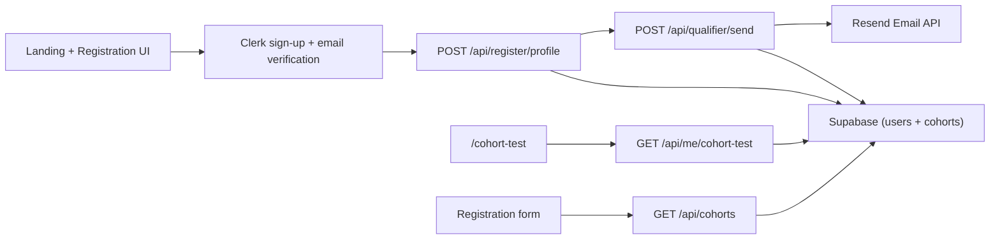

# OptCamp

OptCamp is the application and qualifier orchestration app for Optern cohorts.

It handles:
- Candidate registration with Clerk Auth
- Email verification (Clerk email code flow)
- Post-verification qualifier email delivery (via Resend)
- Cohort assignment and cohort test dashboard

## Product Flow
1. Candidate applies from landing page (`/`) with profile + cohort selection.
2. App creates a Clerk account and sends email verification code.
3. Candidate verifies email in-app.
4. App persists profile data to `public.users` via `POST /api/register/profile`.
5. Server sends cohort-specific qualifier URL through `POST /api/qualifier/send`.
6. Candidate uses `/cohort-test` to view assigned cohort, all cohorts, and start test.

## Architecture


## Tech Stack
- Next.js 16 (App Router)
- React 19 + TypeScript
- Clerk Auth
- Supabase Postgres (database only)
- Resend (email delivery)
- Tailwind CSS v4
- Biome

## Data Model

### `public.users`
Important columns:
- `id uuid` (app user id)
- `clerk_user_id text unique`
- `email text`
- `name text`
- `university text`
- `stack text`
- `github text`
- `availability boolean`
- `intent text`
- `email_verified boolean`
- `cohort_id uuid` (references `public.cohorts.id`)
- `qualifier_email_sent_at timestamptz`
- `qualifier_email_message_id text`

### `public.cohorts`
- `id uuid`
- `slug text unique`
- `type text`
- `apply_window text`
- `sprint_window text`
- `apply_by text`
- `qualifier_test_url text`
- `is_active boolean`
- `created_at timestamptz`

### `public.qualifier_email_logs`
- `id bigint`
- `user_id uuid`
- `cohort_id uuid`
- `recipient_email text`
- `resend_message_id text`
- `status text`
- `sent_at timestamptz`

## API Contracts

### `GET /api/cohorts`
Purpose:
- Fetch cohort list for registration dropdown and landing cards.

Response:
- `200 { cohorts: Cohort[] }`
- `500 { error: string }`

### `POST /api/register/profile`
Auth:
- Clerk session cookie

Purpose:
- Persist or update candidate profile after Clerk signup verification.

Response:
- `200 { ok: true }`
- `400 { error: string }`
- `401 { error: "Unauthorized." }`
- `500 { error: string }`

### `GET /api/me/cohort-test`
Auth:
- Clerk session cookie

Purpose:
- Return current user profile, assigned cohort, and full cohort list.

Response:
- `200 { user: UserProfile, assignedCohort: Cohort | null, cohorts: Cohort[] }`
- `401 { error: "Unauthorized." }`
- `500 { error: string }`

### `POST /api/qualifier/send`
Auth:
- Clerk session cookie

Purpose:
- Idempotently send qualifier email for verified users.

Behavior:
- Returns `alreadySent: true` if `qualifier_email_sent_at` already exists.
- Requires verified email + assigned cohort + configured `qualifier_test_url`.

Response:
- `200 { ok: true, alreadySent: boolean, sentAt?: string, messageId?: string }`
- `401 { error: "Unauthorized." }`
- `409 { error: string }` for unverified/missing cohort/missing link
- `500/502 { error: string }`

## Environment Variables
Copy `.env.example` to `.env.local` and fill values:

- `NEXT_PUBLIC_SUPABASE_URL`
- `SUPABASE_SERVICE_ROLE_KEY` (server only; never expose client-side)
- `NEXT_PUBLIC_CLERK_PUBLISHABLE_KEY`
- `CLERK_SECRET_KEY`
- `NEXT_PUBLIC_APP_URL` (example: `http://localhost:3000`)
- `RESEND_API_KEY`
- `QUALIFIER_FROM_EMAIL` (example: `Optern <no-reply@yourdomain.com>`)

## Local Setup
1. Install dependencies:
```bash
npm install
```

2. Configure env vars:
```bash
cp .env.example .env.local
```

3. In Supabase SQL Editor, run in order:
- `supabase/users_setup.sql`
- `supabase/20260228_qualifier_flow.sql`
- `supabase/20260228_clerk_auth_migration.sql` (only for existing deployments migrating from Supabase Auth)

4. Start dev server:
```bash
npm run dev
```

5. Open app:
- Landing and apply: `http://localhost:3000`
- Cohort test dashboard: `http://localhost:3000/cohort-test`

## Core File Map
- `proxy.ts`: Clerk middleware (`clerkMiddleware`) for App Router + APIs.
- `app/layout.tsx`: App shell with `ClerkProvider` and auth controls.
- `app/page.tsx`: Landing page + apply entry + cohort cards (API-backed).
- `app/components/RegistrationPage.tsx`: Clerk sign-up + email verification + profile sync.
- `app/cohort-test/page.tsx`: Authenticated cohort dashboard with Clerk session.
- `app/api/register/profile/route.ts`: Profile persistence endpoint.
- `app/api/cohorts/route.ts`: Cohort list endpoint.
- `app/api/me/cohort-test/route.ts`: User cohort dashboard payload endpoint.
- `app/api/qualifier/send/route.ts`: Qualifier email sender.
- `lib/clerkServer.ts`: Clerk server-side auth/user helper.
- `lib/supabaseAdmin.ts`: Server service-role Supabase client.
- `lib/env.ts`: Runtime env validation helpers.
- `lib/types.ts`: Shared `Cohort` and `UserProfile` types.

## Operational Notes
- Qualifier email send is idempotent through `users.qualifier_email_sent_at`.
- Registration now uses Clerk verification and then writes profile data to Supabase.
- Supabase Auth is no longer used in runtime flow.

## Known Limitations / Next Steps
- Cohort dates are currently stored as display strings, not normalized date columns.
- No admin panel yet for managing cohorts and qualifier URLs.
- No webhook retry worker for email delivery failures.
- Add e2e tests for signup verification, profile sync, and email idempotency.
