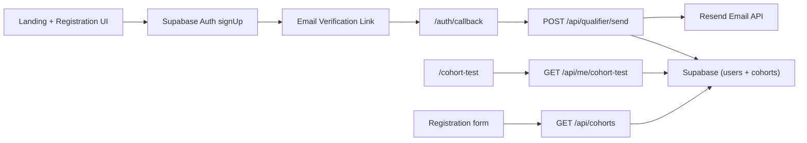

# OptCamp

OptCamp is the application and qualifier orchestration app for Optern cohorts.

It handles:
- Candidate registration with Supabase Auth
- Email verification callback handling
- Post-verification qualifier email delivery (via Resend)
- Cohort assignment and cohort test dashboard

## Product Flow
1. Candidate applies from landing page (`/`) with profile + cohort selection.
2. App creates a Supabase Auth user (`signUp`) and stores profile metadata.
3. Candidate verifies email through Supabase verification link.
4. `/auth/callback` validates session and triggers `POST /api/qualifier/send`.
5. Server sends the cohort-specific qualifier URL through Resend.
6. Candidate uses `/cohort-test` to view assigned cohort, all cohorts, and start test.

## Architecture


## Tech Stack
- Next.js 16 (App Router)
- React 19 + TypeScript
- Supabase Auth + Postgres
- Resend (email delivery)
- Tailwind CSS v4
- Biome

## Data Model

### `public.users` (existing + extended)
Important columns:
- `id uuid` (references `auth.users.id`)
- `email text`
- `name text`
- `university text`
- `stack text`
- `github text`
- `availability boolean`
- `intent text`
- `email_verified boolean`
- `cohort_id uuid` (new; references `public.cohorts.id`)
- `qualifier_email_sent_at timestamptz` (new)
- `qualifier_email_message_id text` (new)

### `public.cohorts` (new)
- `id uuid`
- `slug text unique`
- `type text`
- `apply_window text`
- `sprint_window text`
- `apply_by text`
- `qualifier_test_url text`
- `is_active boolean`
- `created_at timestamptz`

### `public.qualifier_email_logs` (new)
- `id bigint`
- `user_id uuid`
- `cohort_id uuid`
- `recipient_email text`
- `resend_message_id text`
- `status text`
- `sent_at timestamptz`

## API Contracts

### `GET /api/cohorts`
Purpose:
- Fetch cohort list for registration dropdown and landing cards.

Response:
- `200 { cohorts: Cohort[] }`
- `500 { error: string }`

### `GET /api/me/cohort-test`
Auth:
- `Authorization: Bearer <supabase_access_token>`

Purpose:
- Return current user profile, assigned cohort, and full cohort list.

Response:
- `200 { user: UserProfile, assignedCohort: Cohort | null, cohorts: Cohort[] }`
- `401 { error: "Unauthorized." }`
- `500 { error: string }`

### `POST /api/qualifier/send`
Auth:
- `Authorization: Bearer <supabase_access_token>`

Purpose:
- Idempotently send qualifier email after verification.

Behavior:
- Returns `alreadySent: true` if `qualifier_email_sent_at` already exists.
- Requires verified email + assigned cohort + configured `qualifier_test_url`.

Response:
- `200 { ok: true, alreadySent: boolean, sentAt?: string, messageId?: string }`
- `401 { error: "Unauthorized." }`
- `409 { error: string }` for unverified/missing cohort/missing link
- `500/502 { error: string }`

## Environment Variables
Copy `.env.example` to `.env.local` and fill values:

- `NEXT_PUBLIC_SUPABASE_URL`
- `NEXT_PUBLIC_SUPABASE_ANON_KEY`
- `SUPABASE_SERVICE_ROLE_KEY` (server only; never expose client-side)
- `NEXT_PUBLIC_APP_URL` (example: `http://localhost:3000`)
- `RESEND_API_KEY`
- `QUALIFIER_FROM_EMAIL` (example: `Optern <no-reply@yourdomain.com>`)

## Local Setup
1. Install dependencies:
```bash
npm install
```

2. Configure env vars:
```bash
cp .env.example .env.local
```

3. In Supabase SQL Editor, run in order:
- `supabase/users_setup.sql`
- `supabase/20260228_qualifier_flow.sql`

4. Start dev server:
```bash
npm run dev
```

5. Open app:
- Landing and apply: `http://localhost:3000`
- Callback: `http://localhost:3000/auth/callback`
- Cohort test dashboard: `http://localhost:3000/cohort-test`

## Core File Map
- `app/page.tsx`: Landing page + apply entry + cohort cards (API-backed).
- `app/components/RegistrationPage.tsx`: Supabase sign-up form with cohort selection.
- `app/auth/callback/page.tsx`: Verification state handling + qualifier send trigger.
- `app/cohort-test/page.tsx`: Authenticated cohort dashboard + fallback email send UI.
- `app/api/cohorts/route.ts`: Cohort list endpoint.
- `app/api/me/cohort-test/route.ts`: User cohort dashboard payload endpoint.
- `app/api/qualifier/send/route.ts`: Post-verification qualifier email sender.
- `lib/supabaseClient.ts`: Browser Supabase client.
- `lib/supabaseAdmin.ts`: Server service-role Supabase client.
- `lib/apiAuth.ts`: Bearer token extraction helper.
- `lib/env.ts`: Runtime env validation helpers.
- `lib/types.ts`: Shared `Cohort` and `UserProfile` types.
- `supabase/users_setup.sql`: Base users table + sync triggers.
- `supabase/20260228_qualifier_flow.sql`: Cohorts, logs, and qualifier flow migration.

## Operational Notes
- Qualifier email send is idempotent through `users.qualifier_email_sent_at`.
- Callback sends automatically; `/cohort-test` supports manual resend fallback.
- `users` sync trigger maps `auth.users.raw_user_meta_data` into `public.users`.
- A DB trigger blocks authenticated users from mutating `qualifier_email_*` fields.
- Service role key is used only in server routes and must not be exposed in client code.

## Known Limitations / Next Steps
- Cohort dates are currently stored as display strings, not normalized date columns.
- No admin panel yet for managing cohorts and qualifier URLs.
- No webhook retry worker for email delivery failures.
- Add e2e tests for callback and email send idempotency.
