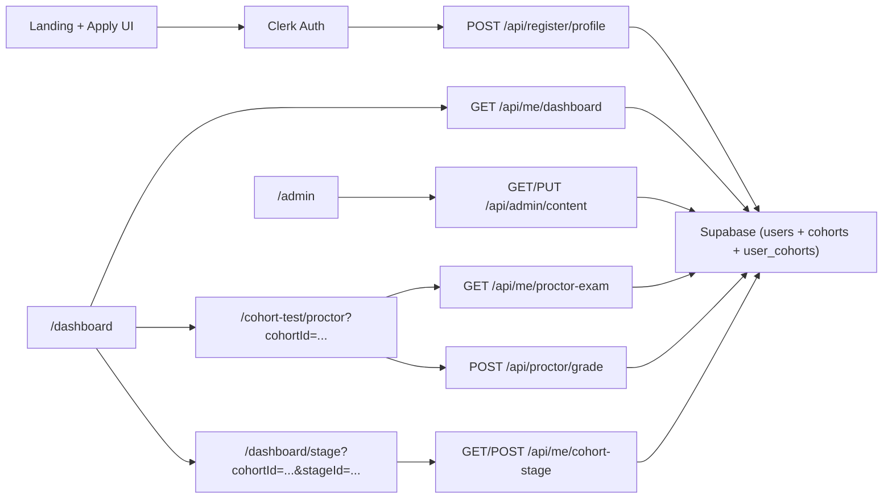

# OptCamp

OptCamp is the application, qualifier, and cohort progression app for Optern cohorts.

It now handles:
- Signed-in cohort applications with Clerk Auth
- Profile persistence in Supabase
- Cohort dashboarding at `/dashboard`
- Admin content management at `/admin`
- Proctored qualifier attempts with persisted scores
- Progressive cohort stage tests that unlock one by one
- Rich assessment content with MCQs, debugging prompts, and sprint scenarios

## Product Flow
1. Candidate signs in with Clerk.
2. Candidate applies from the landing page (`/`) using a shortened application form.
3. The app upserts the candidate profile in `public.users` and links the application in `public.user_cohorts`.
4. Candidate opens `/dashboard` to see all applied and joined cohorts.
5. Candidate launches a cohort-specific timed qualifier.
6. If the qualifier score is `70+`, the user is automatically enrolled in that cohort.
7. Enrolled users unlock cohort stage tests progressively, one stage at a time.

## Architecture

```mermaid
flowchart LR
  A["Landing + Apply UI"] --> B["Clerk Auth"]
  B --> C["POST /api/register/profile"]
  C --> D["Supabase (users + cohorts + user_cohorts)"]
  E["/dashboard"] --> F["GET /api/me/dashboard"]
  F --> D
  L["/admin"] --> M["GET/PUT /api/admin/content"]
  M --> D
  E --> G["/cohort-test/proctor?cohortId=..."]
  G --> H["GET /api/me/proctor-exam"]
  H --> D
  G --> I["POST /api/proctor/grade"]
  I --> D
  E --> J["/dashboard/stage?cohortId=...&stageId=..."]
  J --> K["GET/POST /api/me/cohort-stage"]
  K --> D
```

## Tech Stack
- Next.js 16 (App Router)
- React 19 + TypeScript
- Clerk Auth
- Supabase Postgres (database only)
- Tailwind CSS v4
- Biome

## Data Model

### `public.users`
Important columns:
- `id uuid`
- `clerk_user_id text unique`
- `email text`
- `name text`
- `university text`
- `stack text`
- `github text`
- `availability boolean`
- `intent text`

### `public.cohorts`
- `id uuid`
- `slug text unique`
- `type text`
- `apply_window text`
- `sprint_window text`
- `apply_by text`
- `qualifier_test_url text`
- `is_active boolean`
- `created_at timestamptz`

### `public.user_cohorts`
- `user_id uuid`
- `cohort_id uuid`
- `status text`
  Supported values:
  `applied`, `qualifier_in_progress`, `qualifier_failed`, `qualifier_passed`, `enrolled`, `completed`
- `applied_at timestamptz`
- `qualifier_score integer`
- `qualifier_feedback text`
- `qualifier_started_at timestamptz`
- `qualifier_submitted_at timestamptz`
- `qualified_at timestamptz`
- `enrolled_at timestamptz`
- `completed_at timestamptz`

### `public.qualifier_attempts`
- `id uuid`
- `user_id uuid`
- `cohort_id uuid`
- `exam_id text`
- `subject text`
- `cohort_type text`
- `answers jsonb`
- `score integer`
- `feedback text`
- `passed boolean`
- `started_at timestamptz`
- `submitted_at timestamptz`

### `public.cohort_qualifier_templates`
- `id uuid`
- `cohort_id uuid`
- `duration_seconds integer`
- `questions jsonb`
- `updated_at timestamptz`

Question payloads now support:
- `type`: `mcq`, `debug`, `scenario`
- shared fields: `id`, `prompt`, `guidance`, `rubric`, `solution`
- MCQ fields: `options[]`, `correctOptionIds[]`, `allowMultiple`
- Debug fields: `language`, `starterCode`, `expectedOutcome`
- Scenario fields: `deliverable`, `constraints[]`

### `public.cohort_stages`
- `id uuid`
- `cohort_id uuid`
- `stage_number integer`
- `title text`
- `description text`
- `duration_minutes integer`
- `questions jsonb`
- `created_at timestamptz`

### `public.user_cohort_stage_attempts`
- `id uuid`
- `user_id uuid`
- `cohort_id uuid`
- `stage_id uuid`
- `answers jsonb`
- `score integer`
- `feedback text`
- `passed boolean`
- `submitted_at timestamptz`

## API Contracts

### `GET /api/cohorts`
Purpose:
- Fetch cohort list for landing cards and application selection.

Response:
- `200 { cohorts: Cohort[] }`
- `500 { error: string }`

### `POST /api/register/profile`
Auth:
- Clerk session cookie

Purpose:
- Upsert the signed-in user profile and apply to the selected cohort.
- Uses Clerk as the source of truth for identity fields.

Response:
- `200 { ok: true }`
- `400 { error: string }`
- `401 { error: "Unauthorized." }`
- `500 { error: string }`

### `GET /api/me/dashboard`
Auth:
- Clerk session cookie

Purpose:
- Return the current user profile, all cohort memberships, all cohorts, and dashboard summary metrics.

Response:
- `200 { user, memberships, cohorts, summary }`
- `401 { error: "Unauthorized." }`
- `500 { error: string }`

### `GET /api/me/proctor-exam?cohortId=...`
Auth:
- Clerk session cookie

Purpose:
- Initialize a qualifier attempt for the selected cohort and return the cohort-specific exam payload.

Response:
- `200 { cohortId, examId, subject, cohortType, durationSeconds, questions }`
- `400 { error: string }`
- `401 { error: "Unauthorized." }`
- `409 { error: string }`
- `500 { error: string }`

### `POST /api/proctor/grade`
Auth:
- Clerk session cookie

Purpose:
- Grade and persist a qualifier attempt.
- If score is `70+`, mark the user as enrolled in the cohort.

Response:
- `200 { score, feedback, passed }`
- `400 { error: string }`
- `401 { error: "Unauthorized." }`
- `409 { error: string }`
- `500 { error: string }`

### `GET /api/me/cohort-stage?cohortId=...&stageId=...`
Auth:
- Clerk session cookie

Purpose:
- Fetch a stage test only if it is unlocked for the current user.

### `GET /api/admin/content`
Auth:
- Clerk session cookie

Purpose:
- Load all cohorts plus editable qualifier and stage content bundles for the admin dashboard.

Response:
- `200 { cohorts, contentByCohort }`

### `POST /api/admin/content/import-pdf`
Auth:
- Clerk session cookie

Purpose:
- Parse a structured PDF upload into the same `AssessmentQuestion[]` format used by the admin dashboard.
- Intended for the import panels shown alongside the qualifier and stage question editors in `/admin`.

Response:
- `200 { questions, extractedTextLength }`
- `400 { error: string }`
- `401 { error: "Unauthorized." }`

## PDF Import Format
The admin dashboard can import questions from a PDF, but the PDF should contain plain, copyable text and follow a strict block structure so the parser can map each question into the app schema reliably.

Rules:
- Start each question block with `QUESTION` or `QUESTION 1`, `QUESTION 2`, etc.
- End each block with `END QUESTION`.
- Use `Field Name: value` for one-line fields.
- For multi-line fields, put the label on its own line with a trailing colon, then place the content underneath it.
- MCQ options must be bullet lines under `Options:` and mark correct answers with `[x]`, `[X]`, `[correct]`, or `[✓]`.
- Incorrect MCQ options should use `[ ]`.
- Scenario constraints should be bullet lines under `Constraints:`.
- `Solution:` is optional, but recommended so the imported question retains an answer key or reference approach in admin.
- The parser ignores styling, so avoid relying on visual layout alone to convey meaning.

Supported fields by type:
- Shared: `Type`, `Prompt`, `Guidance`, `Rubric`, `Solution`
- MCQ: `Allow Multiple`, `Options`
- Debug: `Language`, `Starter Code`, `Expected Outcome`
- Scenario: `Deliverable`, `Constraints`

Example PDF text:

````text
QUESTION 1
Type: mcq
Prompt:
Which deployment strategy is best for validating a risky release with a small
slice of production traffic first?
Guidance:
Pick the safest progressive delivery method.
Rubric:
Strong answers should minimize blast radius before global rollout.
Solution:
Use a canary release because it validates real traffic gradually.
Allow Multiple: false
Options:
- [ ] Big-bang deploy during off-hours
- [x] Canary release with staged rollout
- [ ] Full blue-green cutover to every user
- [ ] Shadow deploy with no user-facing reads
END QUESTION

QUESTION 2
Type: debug
Prompt:
An API started timing out after a dependency upgrade. Walk through how you
would debug it.
Guidance:
Cover telemetry, reproduction, rollback criteria, and how you isolate the
change.
Rubric:
Strong answers identify baselines, traces, and mitigation steps.
Solution:
Compare pre/post-upgrade latency, inspect traces, isolate the slow dependency,
and define rollback plus instrumentation.
Language: typescript
Starter Code:
```ts
export async function fetchAccount(id: string) {
  const profile = await profileClient.get(id);
  const invoices = await billingClient.listInvoices(id);
  return { profile, invoices };
}
```
Expected Outcome:
Candidate explains where to instrument, what changed, and how to restore
stability safely.
END QUESTION

QUESTION 3
Type: scenario
Prompt:
Design the first 48 hours of an engineering sprint for a reliability fix.
Guidance:
Show milestones, owners, and risk controls.
Rubric:
Look for sequencing, execution realism, and communication.
Solution:
An ideal answer includes triage, implementation, observability, validation, and
stakeholder updates.
Deliverable: Execution plan
Constraints:
- One backend engineer and one frontend engineer
- Fix must be observable in production metrics
- Stakeholder update due by end of day two
END QUESTION
````
- `401 { error: "Unauthorized." }`
- `403 { error: string }`

### `PUT /api/admin/content`
Auth:
- Clerk session cookie

Purpose:
- Upsert qualifier templates and cohort stages for a selected cohort.
- Deletes removed stages and preserves stage order based on the submitted array.

Response:
- `200 { cohorts, contentByCohort }`
- `400 { error: string }`
- `401 { error: "Unauthorized." }`
- `403 { error: string }`
- `500 { error: string }`

### `POST /api/me/cohort-stage`
Auth:
- Clerk session cookie

Purpose:
- Grade and persist a cohort stage attempt.
- Passing the final stage marks the cohort as completed.

Response:
- `200 { score, feedback, passed }`
- `400 { error: string }`
- `401 { error: "Unauthorized." }`
- `403 { error: string }`
- `404 { error: string }`
- `500 { error: string }`

## Environment Variables
Copy `.env.example` to `.env.local` and fill values:

- `NEXT_PUBLIC_SUPABASE_URL`
- `SUPABASE_SERVICE_ROLE_KEY`
- `NEXT_PUBLIC_CLERK_PUBLISHABLE_KEY`
- `CLERK_SECRET_KEY`
- `NEXT_PUBLIC_APP_URL`
- `OPTERN_ADMIN_EMAILS`
  Optional comma-separated allowlist. If omitted, any signed-in user can open `/admin`, which is convenient for local development but not recommended for production.

## Local Setup
1. Install dependencies:
```bash
npm install
```

2. Configure env vars:
```bash
cp .env.example .env.local
```

3. In Supabase SQL Editor, run in order:
- `supabase/users_setup.sql`
- `supabase/20260228_qualifier_flow.sql`
- `supabase/20260228_clerk_auth_migration.sql`
- `supabase/20260318_dashboard_progression.sql`
- `supabase/20260319_admin_content_studio.sql`

4. Start dev server:
```bash
npm run dev
```

5. Open the app:
- Landing and apply: `http://localhost:3000`
- Dashboard: `http://localhost:3000/dashboard`
- Admin content studio: `http://localhost:3000/admin`
- Legacy cohort route: `http://localhost:3000/cohort-test` (redirects to dashboard)

## Core File Map
- `app/page.tsx`: Landing page and apply entry state.
- `app/components/RegistrationPage.tsx`: Signed-in application form.
- `app/dashboard/page.tsx`: Main cohort dashboard.
- `app/admin/page.tsx`: Admin dashboard for qualifier and stage content authoring.
- `app/dashboard/stage/page.tsx`: Progressive stage test screen.
- `app/cohort-test/proctor/page.tsx`: Proctored qualifier screen.
- `app/cohort-test/page.tsx`: Redirects legacy traffic to `/dashboard`.
- `app/components/AssessmentRunner.tsx`: Shared question runner with palette navigation, next/previous actions, and review markers.
- `app/api/admin/content/route.ts`: Admin content load/save endpoint.
- `app/api/me/dashboard/route.ts`: Dashboard payload endpoint.
- `app/api/register/profile/route.ts`: Signed-in application/profile sync endpoint.
- `app/api/me/proctor-exam/route.ts`: Cohort-specific qualifier initializer.
- `app/api/proctor/grade/route.ts`: Qualifier grading and persistence endpoint.
- `app/api/me/cohort-stage/route.ts`: Stage fetch/submit endpoint with unlock enforcement.
- `lib/assessment.ts`: Rich question normalization, defaults, and content helpers.
- `lib/admin.ts`: Admin allowlist helper for `/admin` and admin APIs.
- `lib/dashboard.ts`: Shared dashboard/progression loader.
- `lib/grading.ts`: Shared grading helpers and passing threshold.
- `lib/types.ts`: Shared app types for cohorts, memberships, attempts, and stages.

## Operational Notes
- Clerk is the source of truth for signed-in user identity.
- The qualifier passing threshold is `70`.
- Admin-authored qualifier templates are stored in `public.cohort_qualifier_templates`.
- Cohort stages can now mix MCQs, debugging prompts, and implementation scenarios, and they still unlock progressively.
- `/cohort-test` remains as a compatibility route, but `/dashboard` is the canonical user workspace.

## Verification Notes
- `npx tsc --noEmit` passes.
- `next build` currently requires valid Clerk env vars at build time; without `NEXT_PUBLIC_CLERK_PUBLISHABLE_KEY`, prerendering fails before deployment.
